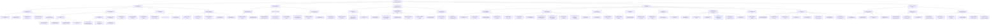

```mermaid
graph TD
    Root["Rehabilitación De Tramo Vial Guarjila - Las Vueltas"] --> L1_1["1. Gestión y Administración del Proyecto"]
    Root --> L1_2["2. Estudios, Diseños Definitivos y Permisos"]
    Root --> L1_3["3. Derecho de Vía, Reasentamiento y Participación Comunitaria"]
    Root --> L1_4["4. Infraestructura Vial Rehabilitada"]
    Root --> L1_5["5. Supervisión, Control de Calidad y Recepción de Obra"]

    %% Branch 1
    L1_1 --> 1.1["1.1 Planes de Dirección, Control y Reservas"]
    L1_1 --> 1.2["1.2 Contratos Adjudicados y Garantías"]
    L1_1 --> 1.3["1.3 Administración de Contratos"]
    L1_1 --> 1.4["1.4 Informes, Desembolsos y Cierre Administrativo"]

    1.1 --> 1.1.1["1.1.1 Plan de Dirección del Proyecto"]
    1.1 --> 1.1.2["1.1.2 Equipo de la UEP Asignado al Proyecto"]
    1.1 --> 1.1.3["1.1.3 Planes de Calidad, Comunicaciones y Interesados"]
    1.1 --> 1.1.4["1.1.4 Registro de Riesgos y Reportes de Control de Costos y Cronograma"]
    1.1 --> 1.1.5["1.1.5 Reservas de Contingencia y De Gestión"]

    1.2 --> 1.2.1["1.2.1 Contratación de la Obra"]
    1.2.1 --> 1.2.1.1["1.2.1.1 Documentos De Licitación Aprobados"]
    1.2.1 --> 1.2.1.2["1.2.1.2 Llamado Publicado y Ofertas Recibidas"]
    1.2.1 --> 1.2.1.3["1.2.1.3 Ofertas Evaluadas y Adjudicación Aprobada"]
    1.2.1 --> 1.2.1.4["1.2.1.4 Contrato de Obra Firmado"]
    1.2 --> 1.2.2["1.2.2 Contratación de la Supervisión"]
    1.2.2 --> 1.2.2.1["1.2.2.1 Términos de Referencia y Solicitud de Propuestas Aprobados"]
    1.2.2 --> 1.2.2.2["1.2.2.2 Propuestas Evaluadas y Firma Seleccionada"]
    1.2.2 --> 1.2.2.3["1.2.2.3 Contrato de Supervisión Firmado"]
    1.2 --> 1.2.3["1.2.3 Contrato de Auditoría Externa Firmado"]
    1.2 --> 1.2.4["1.2.4 Contratos de Servicios Específicos Firmados"]
    1.2 --> 1.2.5["1.2.5 Garantías y Seguros del Contratista Recibidos y Verificados"]

    1.3 --> 1.3.1["1.3.1 Actas de Inicio y Órdenes de Proceder Emitidas"]
    1.3 --> 1.3.2["1.3.2 Adendas, Órdenes de Cambio y Ajustes de Precios Tramitados"]
    1.3 --> 1.3.3["1.3.3 Pagos Tramitados"]
    1.3 --> 1.3.4["1.3.4 Reclamos y Controversias Resueltos"]

    1.4 --> 1.4.1["1.4.1 Informes Semestrales de Progreso al BID"]
    1.4 --> 1.4.2["1.4.2 Solicitudes de Anticipo de Fondos y Justificaciones"]
    1.4 --> 1.4.3["1.4.3 Información para Auditoría Financiera Entregada"]
    1.4 --> 1.4.4["1.4.4 Finiquito y Liquidación de Contratos"]
    1.4 --> 1.4.5["1.4.5 Informe Final y Lecciones Aprendidas"]

    %% Branch 2
    L1_2 --> 2.1["2.1 Estudios De Campo y de Tránsito Validados"]
    L1_2 --> 2.2["2.2 Diseño Final Aprobado"]
    L1_2 --> 2.3["2.3 Licencias, Permisos y Convenios Legales"]

    2.1 --> 2.1.1["2.1.1 Estudios Topográfico, Geotécnico e Hidrológico Validados"]
    2.1 --> 2.1.2["2.1.2 Estudio de Tránsito y Ejes Equivalentes Validado"]

    2.2 --> 2.2.1["2.2.1 Planos Geométricos, de Secciones Típicas y de Pavimento Aprobados"]
    2.2 --> 2.2.2["2.2.2 Planos de Drenaje, Muros y Obras de Protección Aprobados"]
    2.2 --> 2.2.3["2.2.3 Especificaciones Técnicas y Presupuesto Definitivos"]

    2.3 --> 2.3.1["2.3.1 Resolución Ambiental del MARN Vigente y Modificada con el Diseño Final"]
    2.3 --> 2.3.2["2.3.2 Permiso de Tala y Compensación Forestal Aprobados"]
    2.3 --> 2.3.3["2.3.3 Permisos Municipales Obtenidos"]
    2.3 --> 2.3.4["2.3.4 Línea Base de Biodiversidad y Plan de Acción Aprobados"]

    %% Branch 3
    L1_3 --> 3.1["3.1 Catastro, Censo y Avalúos"]
    L1_3 --> 3.2["3.2 Reasentamiento, Compensación y Derecho de Vía"]
    L1_3 --> 3.3["3.3 Participación y Atención Comunitaria"]

    3.1 --> 3.1.1["3.1.1 Levantamiento Catastral e Inventario de Afectaciones"]
    3.1 --> 3.1.2["3.1.2 Censo Socioeconómico de Familias, Negocios y Accesos Afectados"]
    3.1 --> 3.1.3["3.1.3 Avalúos Comerciales Oficiales"]

    3.2 --> 3.2.1["3.2.1 PAR y PRMS Aprobados por el BID"]
    3.2 --> 3.2.2["3.2.2 Autorizaciones de Ingreso, Convenios y Escrituras Firmados con Propietarios"]
    3.2 --> 3.2.3["3.2.3 Indemnizaciones y Compensaciones Pagadas"]
    3.2 --> 3.2.4["3.2.4 Derecho de Vía Inscrito en el CNR a Favor del Estado"]
    3.2 --> 3.2.5["3.2.5 Informe de Auditoría Externa de Cierre del PAR/PRMS"]

    3.3 --> 3.3.1["3.3.1 Comité Ciudadano de Seguimiento Operando"]
    3.3 --> 3.3.2["3.3.2 Consultas y Asambleas de Seguimiento Realizadas"]
    3.3 --> 3.3.3["3.3.3 Informes Consolidados de Quejas y Reclamos Atendidos"]

    %% Branch 4
    L1_4 --> 4.1["4.1 Sitio Habilitado y Servicios Implementado"]
    L1_4 --> 4.2["4.2 PGAS Constructivo Implementado"]
    L1_4 --> 4.3["4.3 Terracerías y Subrasante Conformada"]
    L1_4 --> 4.4["4.4 Estructura del Pavimento"]
    L1_4 --> 4.5["4.5 Estructura del Pavimento"]
    L1_4 --> 4.6["4.6 Señalización, Seguridad Vial y Obras Peatonales"]
    L1_4 --> 4.7["4.7 Control de Calidad del Contratista"]
    L1_4 --> 4.8["4.8 Cierre de Obra del Contratista"]

    4.1 --> 4.1.1["4.1.1 Movilización y Planes Aprobados"]
    4.1 --> 4.1.2["4.1.2 Derecho de Vía Trazado, Nivelado y Desbrozado"]
    4.1 --> 4.1.3["4.1.3 Servicios Afectados Reubicados Físicamente"]
    4.1 --> 4.1.4["4.1.4 Campamento, Oficinas y Laboratorio Instalados"]
    4.1 --> 4.1.5["4.1.5 Plan de Manejo de Tráfico Temporal Implementado"]

    4.2 --> 4.2.1["4.2.1 Plan de SST y Gestión Laboral Implementado"]
    4.2 --> 4.2.2["4.2.2 Medidas Ambientales Implementadas"]
    4.2 --> 4.2.3["4.2.3 Oficina de Gestión Social, Especialista Social y Mecanismo de Quejas Operando"]
    4.2 --> 4.2.4["4.2.4 Educación Vial, Igualdad de Género y Mano de Obra Local Implementadas"]
    4.2 --> 4.2.5["4.2.5 Compensación Forestal Ejecutada y Mantenida"]
    4.2 --> 4.2.6["4.2.6 Informes Mensuales de Cumplimiento Socioambiental Presentados"]

    4.3 --> 4.3.1["4.3.1 Cortes y Taludes Conformados"]
    4.3 --> 4.3.2["4.3.2 Subrasante Mejorada y Compactada"]
    4.3 --> 4.3.3["4.3.3 Material Excedente Dispuesto en Botaderos Autorizados"]

    4.4 --> 4.4.1["4.4.1 Obras de Drenaje Transversal y Subdrenes Construidos"]
    4.4 --> 4.4.2["4.4.2 Cunetas Revestidas y Canaletas Construidas"]
    4.4 --> 4.4.3["4.4.3 Muros de Retención y Protecciones de Talud Construidos"]

    4.5 --> 4.5.1["4.5.1 Base Tratada con Cemento Colocada y Curada"]
    4.5 --> 4.5.2["4.5.2 Riego de Imprimación y Liga Aplicado"]
    4.5 --> 4.5.3["4.5.3 Carpeta Asfáltica Colocada"]

    4.6 --> 4.6.1["4.6.1 Señalización Horizontal Aplicada"]
    4.6 --> 4.6.2["4.6.2 Señalización Vertical Instalada"]
    4.6 --> 4.6.3["4.6.3 Barreras Metálicas de Resguardo"]
    4.6 --> 4.6.4["4.6.4 Aceras con Accesibilidad Universal y Paradas de Bus Construidas"]
    4.6 --> 4.6.5["4.6.5 Túmulos, Bandas Vibratorias y Pasos Peatonales Construidos"]
    4.6 --> 4.6.6["4.6.6 Plazoleta y Mirador Rehabilitado"]

    4.7 --> 4.7.1["4.7.1 Plan y Registros de Control de Calidad de Contratista"]

    4.8 --> 4.8.1["4.8.1 Equipos, Maquinaria y Personal Desmovilizados"]
    4.8 --> 4.8.2["4.8.2 Campamento, Oficinas y Laboratorio Desmontados"]
    4.8 --> 4.8.4["4.8.4 Desvíos y Señalización Temporal Retirados"]
    4.8 --> 4.8.5["4.8.5 Planos as-built elaborados"]
    4.8 --> 4.8.6["4.8.6 Expediente Técnico de Obra Entregado"]
    4.8 --> 4.8.7["4.8.7 Informe Final Ambiental y Social del PGAS Constructivo"]
    4.8 --> 4.8.8["4.8.8 Garantía de Buena Obra Presentada"]
    4.8 --> 4.8.9["4.8.9 Solicitud de Recepción y Estimación Final Presentadas"]

    %% Branch 5
    L1_5 --> 5.1["5.1 Informes y Certificados de Laboratorio"]
    L1_5 --> 5.2["5.2 Inspección Técnica y Estimaciones"]
    L1_5 --> 5.3["5.3 Recepción de Obra y Período de Garantía"]

    5.1 --> 5.1.1["5.1.1 Ensayos de Densidad y Compactación"]
    5.1 --> 5.1.2["5.1.2 Ensayos de Base Tratada con Cemento"]
    5.1 --> 5.1.3["5.1.3 Ensayos de Concreto Estructural"]
    5.1 --> 5.1.4["5.1.4 Ensayos de Mezcla Asfáltica y Núcleos"]

    5.2 --> 5.2.1["5.2.1 PGAS Constructivo y Planes del Contratista Revisados y Aprobados"]
    5.2 --> 5.2.2["5.2.2 Informes de Inspección y Verificación de Especificaciones"]
    5.2 --> 5.2.3["5.2.3 Informes Mensuales de Supervisión"]
    5.2 --> 5.2.4["5.2.4 Estimaciones Mensuales Revisadas y Recomendadas para Pago"]

    5.3 --> 5.3.1["5.3.1 Listado de Observaciones (Punch List) Levantado"]
    5.3 --> 5.3.2["5.3.2 Observaciones Subsanadas por el Contratista"]
    5.3 --> 5.3.3["5.3.3 Planos as-built Revisados y Validados"]
    5.3 --> 5.3.4["5.3.4 Actas de Recepción Provisional y Definitiva Firmadas por el MOP"]
    5.3 --> 5.3.5["5.3.5 Informe de Cumplimiento de Garantía y Liberación de Garantías"]
```